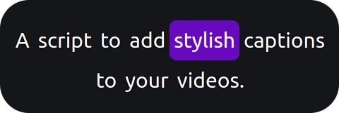

<p align="center">
    
</p>

[](http://npm.im/pupcaps) 
[](https://github.com/hosuaby/PupCaps/actions/workflows/ci.yml)

**PupCaps!** is a Node.js script that makes it easy to add captions to your videos with fully customizable styles. 
Design your captions using CSS, allowing complete control over fonts, colors, positioning, and more. 
CSS3 animations are supported.

You will probably also be interested in [Transcriptionist](https://github.com/hosuaby/Transcriptionist), a tool that uses AI to extract captions from video files.

<p align="center">
    
</p>

## Requirements

You need `node` to be installed on your computer.

If `ffmpeg` binary is missing on your system, it will be installed automatically.

## Install

⚠️ **This Windows fork is only available through GitHub repository cloning. NPM installation is not supported.**

### 🪟 Windows Fork (No Admin Rights Required):

This fork fixes critical Windows compatibility issues:
- ✅ Replaces problematic symlinks with file copying (no admin privileges required)
- ✅ Fixes null timecode parsing errors in SRT files  
- ✅ Adds built-in style support (`default`, `tiktok-modern`)
- ✅ Improved error handling and validation

**Install this fork:**

```shell
git clone https://github.com/ring-rong/pupcaps-fork.git
cd pupcaps-fork
npm install
npm i -g .
```

## Usage

To use the script, you need a **SubRip Subtitle (.srt)** file. PupCaps enables you to create **Karaoke-style captioning** 
(also known as "word-by-word highlighting"). You can use Transcriptionist to extract `.srt` from the original video file.

To achieve this effect, wrap the words you want to highlight in square brackets. For example:

```text
1
00:00:00,000 --> 00:00:00,500
A script to caption videos with style.

2
00:00:00,500 --> 00:00:01,000
[A] script to caption videos with style.

3
00:00:01,000 --> 00:00:01,500
A [script] to caption videos with style.

4
00:00:01,500 --> 00:00:02,000
A script [to] caption videos with style.
```

### Generate Overlay File

Run the PupCaps script to transform your `.srt` file into an **Apple QuickTime (MOV)** file. 
This MOV file will serve as a captions overlay for your video.

```shell
pupcaps path/to/subtitles.srt
```

This command will produce `.mov` in the same folder with subtitles (unless you provided `--output` option). 
Check section "Caption video" to learn how to use this file as overlay.

###### Output File

The resulting `.mov` file will be saved in the same folder as the input `.srt` file unless you specify a different 
output path using the `--output` option. Example:

```shell
pupcaps path/to/subtitles.srt --output path/to/output.mov
```

To learn how to overlay the generated `.mov` file on your video, see the section: "Caption Video."

### Style Captions

The appearance of captions can be fully customized using **CSS**. To do this, copy the contents of the file
[assets/captions.css](./assets/captions.css) and modify it to suit your preferences.

CSS allows you to define styles at various levels:

- The container (captions as a whole).
- Each phrase.
- Individual words.
- Highlighted words for dynamic effects.

Once you've customized your `.css` file, provide it to the PupCaps script using the `--style` option:

```shell
pupcaps path/to/subtitles.srt --style path/to/custom/styles.css
```

#### Built-in Styles

This Windows fork includes built-in styles that you can use without creating CSS files:

```shell
# Use built-in TikTok modern style
pupcaps path/to/subtitles.srt --style tiktok-modern

# Use default style (same as not specifying --style)
pupcaps path/to/subtitles.srt --style default
```

Available built-in styles:
- `default` - Classic PupCaps style with purple highlighting
- `tiktok-modern` - Modern TikTok-style captions with yellow highlighting and larger fonts

#### CSS3 animations

CSS3 provides virtually limitless possibilities for styling captions, including advanced animations. 
For instance, you can create a karaoke-style effect where the background color of a highlighted word gradually changes:

```css
@keyframes shrinkPadding {
    from {
        padding: 30px;
        background-color: #ff92eb;
    }
    to {
        padding: 12px;
        background-color: #670abd;
    }
}

.word.highlighted {
    text-shadow: none;
    animation: shrinkPadding 0.333s ease-in-out;
}
```

To ensure that CSS3 animations are rendered in the output video, use the `--animate` option.

> [!WARNING]  
> Enabling the `--animate` option forces the script to record captions in real-time, meaning the recording process will 
> run for the entire duration of the original video. Use this option only if your captions rely on CSS3 animations.

```shell
pupcaps path/to/subtitles.srt --style path/to/custom/styles.css --animate
```

### Options

**Usage:** `pupcaps [options] <file>`

###### Arguments

| Argument | Description                                    |
|----------|------------------------------------------------|
| file     | Path to the input SubRip Subtitle (.srt) file. |

###### Options

| Option        | Default | Description                                                                                                                                                                |
|---------------|---------|----------------------------------------------------------------------------------------------------------------------------------------------------------------------------|
| -o, --output  |         | Full or relative path where the created Films Apple QuickTime (MOV) file should be written. By default, it will be saved in the same directory as the input subtitle file. |
| -w, --width   | 1080    | Width of the video in pixels.                                                                                                                                              |
| -h, --height  | 1920    | Height of the video in pixels.                                                                                                                                             |
| -s, --style   |         | Style for captions. Can be a built-in style name (`default`, `tiktok-modern`) or a full/relative path to a .css file. If not provided, default styles will be used.         |
| -r, --fps     | 30      | Specifies the frame rate (FPS) of the output video. Valid values are between 1 and 60.                                                                                     |
| -a, --animate |         | Records captions with CSS3 animations. Note: The recording will run for the entire duration of the video. Use this option only if your captions involve CSS3 animations.   |
| --preview     |         | Prevents the script from generating a video file. Instead, captions are displayed in the browser for debugging and preview purposes.                                       |

## Caption Video

To add captions to your video, use **FFmpeg** with the `filter_complex:overlay` filter. 
Below is an example command. You can adjust the codecs and parameters to suit your needs:

```shell
ffmpeg \
  -i original-video.mp4 \
  -i captions.mov \
  -filter_complex "[0:v][1:v]overlay=0:0" \
  -c:v libx264 -b:v 4M -crf 10 \
  -c:a copy \
  output.mp4
```
